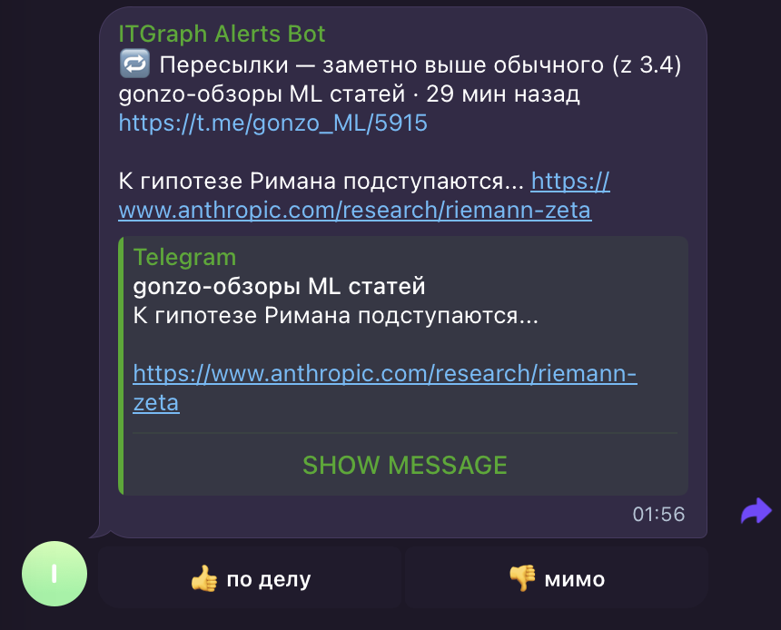
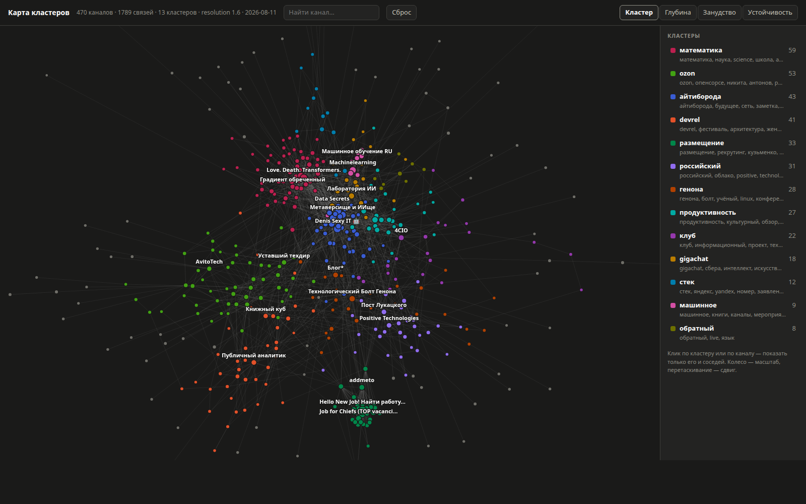

# IT-media graph
Аналитика айтишных телеграм-каналов: кто кого репостит, упоминает и комментирует.

Проект собирает историю публичных IT-каналов в одну базу и строит по ней граф связей: ребро — это репост или упоминание одного канала другим. По графу считается то, ради чего всё затевалось: кто связывает разные сообщества, а кто варится в своём; кого репостят чаще всего; какие посты расходятся дальше остальных; на какие тусовки сцена делится и чем они друг от друга отличаются. Telegram первым, YouTube и остальные площадки — позже.

**Проект в работе.** Сбор, разметка и реалтайм-оповещения доведены до команд и описаны; офлайн-аналитика — кластеризация, роли каналов, стиль письма — живёт отдельными скриптами в [`notebooks/`](notebooks/), которые считают по базе и складывают результат в xlsx, в интерактивную карту и в markdown-отчёты по отдельным каналам.

**Что уже собрано:** 565 каналов в скоупе, 214 тысяч сообщений в сыром слое, 29 тысяч рёбер графа. Снимки счётчиков копятся с 3 августа 2026 — 164 тысячи замеров; порог оповещений настроен примерно на шесть штук в сутки.

## Как устроено

- **Сбор идёт через MTProto (Telethon) от лица обычного аккаунта.** Bot API не умеет читать историю каналов, поэтому собирать ботом нечего — aiogram здесь есть, но только чтобы присылать оповещения оператору. Каналы читаются по username, вступать в них не нужно и вредно: массовые вступления — самый сильный сигнал бана.
- **Сырой слой неизменяем.** Коллектор сохраняет payload как пришёл и ничего в нём не разбирает. Рёбра, метрики и всё остальное производное пересчитывается из него и переживает любую смену правил разбора — а перекачивать историю дорого и рискованно для аккаунта.
- **Хранилище — Postgres**, схема меняется только миграцией Alembic. Графовой базы нет: рёбер немного, граф загружается в память (`networkx` для экспорта, `igraph` с `leidenalg` для кластеризации).
- **Каналы размечает человек.** Что попадает в скоуп, а что нет, решается вручную и хранится в инвентаре; это единственные данные в проекте, которые нельзя восстановить пересчётом, поэтому они регулярно уезжают в проверяемые резервные копии.
- **Личные данные в граф не попадают.** Инвентарь — только публично адресуемые каналы, id пользователей отбрасываются на границе разбора, дампы базы лежат вне репозитория.

## Что где лежит

| путь | что |
|---|---|
| [`src/itgraph/`](src/itgraph/) | CLI-утилита `itgraph` — сбор и разметка базы каналов. Инструкции: [src/itgraph/README.md](src/itgraph/README.md), карта модулей: [src/itgraph/CLAUDE.md](src/itgraph/CLAUDE.md) |
| [`docs/`](docs/) | документация. Пока только [`docs/PLAN.md`](docs/PLAN.md) — примерный план работ, частично устаревший |
| [`notebooks/`](notebooks/) | аналитика: скрипты, строящие граф репостов, кластеризующие каналы и считающие, кого и что репостят больше всего |
| `data/` | результаты аналитики. Таблицы, GEXF и отчёты по каналам в git не идут — в первых есть колонки разметки, а отчёт отправляется один раз и копия в репозитории только напрашивается уйти второй; карта кластеров идёт, в ней только seed-каналы и граф между ними |
| [`deploy/`](deploy/) | Ansible-плейбук: поднимает сбор, бота и таймеры на чистой Ubuntu. [deploy/README.md](deploy/README.md) |
| [`openspec/`](openspec/) | предложения изменений: инфраструктура сначала описывается, потом пишется |
| [`tests/`](tests/) | тесты; сеть замокана, фикстуры анонимизированы |

## Быстрый старт

```bash
uv sync
cp .env.example .env          # заполнить TELEGRAM_API_ID и TELEGRAM_API_HASH
docker compose up -d          # Postgres на порту 5433
uv run alembic upgrade head   # накатить схему
uv run itgraph login          # разовая авторизация в Telegram
```

Дальше — [инструкции к CLI](src/itgraph/README.md): инвентарь каналов, разметка, сбор истории, построение графа. Порядок команд такой:

```bash
uv run itgraph dump-dialogs   # импорт публичных подписок в инвентарь
uv run itgraph mark @channel --seed --kind personal
uv run itgraph backfill --since 2026-01-01   # выкачать историю в сырой слой
uv run itgraph derive         # построить рёбра графа
```

## Оповещения

Поверх сбора работает бот, который присылает в Telegram то, что происходит прямо сейчас. Два вида событий, и они отвечают на разные вопросы:

- **каскад репостов** — пост подхватили несколько независимых семей каналов;
- **всплеск метрики** — просмотров, реакций или пересылок у поста заметно больше, чем набирает пост такого же возраста на этом же канале.

Второе — не «много просмотров», а z-оценка: возраст поста и размер канала учтены отдельно, поэтому пост в 15 минут на канале в 3 тысячи подписчиков и пост в 8 часов на канале в 500 тысяч сравниваются честно. Порог по умолчанию даёт около шести оповещений в сутки.



Кнопки под сообщением — «по делу» и «мимо». Ответы копятся в базе и понадобятся, когда порог придётся двигать: единственное, что говорит, шумит детектор или нет, — это человек, который читал оповещения.

```bash
uv run itgraph watch        # копить снимки счётчиков, бесконечно
uv run itgraph derive       # рёбра из сырого слоя
uv run itgraph alerts       # каскады
uv run itgraph baselines    # что для канала нормально; раз в неделю
uv run itgraph score        # всплески
uv run itgraph bot          # доставлять оператору
```

Сбор — единственная часть, которой нужен MTProto-сеанс; всё остальное читает базу. Бот ходит через Bot API, живёт отдельным процессом и под отдельной ролью в Postgres, которой доступны только таблицы оповещений: токен вполне может оказаться на чужой машине, и роль — это то, что ограничивает ущерб.

Подробности — в [инструкциях к CLI](src/itgraph/README.md); развёртывание на сервер или второй ноутбук — в [`deploy/`](deploy/).

## Аналитика

Скрипты в `notebooks/` — это не часть пакета: они не покрыты тестами и не описаны спекой. Их запускают, смотрят на результат, правят константы в начале файла и запускают снова. Каждый начинается с подробного docstring о том, что именно он считает и чего сознательно не делает.

```bash
uv sync --group data
uv run notebooks/export_graph.py
```

| скрипт | что делает |
|---|---|
| [`export_graph.py`](notebooks/export_graph.py) | подграф seed → seed в GEXF для Gephi |
| [`channel_scorecard.py`](notebooks/channel_scorecard.py) | одна строка на seed-канал: объём, разнообразие связей, вовлечённость |
| [`cited_posts.py`](notebooks/cited_posts.py) | посты, которые репостнули больше двух семей каналов |
| [`anomalous_posts.py`](notebooks/anomalous_posts.py) | посты, обошедшие обычные показатели своего канала |
| [`channel_style.py`](notebooks/channel_style.py) | как канал пишет: длина, код, ссылки, эмодзи; оценки глубины и занудства |
| [`clusters.py`](notebooks/clusters.py) | кластеры каналов по связям: три листа — каналы, кластеры, мосты — и GEXF |
| [`cluster_map.py`](notebooks/cluster_map.py) | те же кластеры интерактивной картой в одном HTML-файле |
| [`channel_report.py`](notebooks/channel_report.py) | отчёт по одному каналу в markdown — то, что можно отдать его автору |

Результат — файлы в `data/`. Общее для всех: рёбра внутри одной семьи аффилированных каналов отбрасываются (автор репостит сам себя, и без вычитания он занимает верх любого рейтинга), а метрики поста — это один снимок, снятый в момент сбора, поэтому свежие посты в подсчёты не идут.

### Кластеры

Сцена делится не по одной оси, и оси спорят между собой — это не помеха, а самый содержательный кусок результата.

**Связи.** Leiden по неориентированному графу репостов *и* упоминаний. Одних репостов не хватает: только 279 каналов из 544 репостят хоть один другой seed-канал, то есть половина инвентаря осталась бы без кластера из-за отсутствия ребра, а не тусовки. С упоминаниями в графе 470 связанных каналов и порядка полутора десятков кластеров — точное число плавает от запуска к запуску, потому что коллектор работает непрерывно и граф растёт под ногами.

**Стиль.** Глубина и занудство — обычные агрегаты по уже собранному тексту, без всякого ML: медианная длина поста расходится в 14 раз между 5-м и 95-м перцентилем, и это разделяет эссеистов и мем-каналы резче, чем что-либо ещё. Обе оценки — среднее робастных z по колонкам, которые лежат в той же таблице, так что любую можно разобрать обратно на числа.

**Расхождение.** У каждого канала считается, какая доля его репостов и какая доля упоминаний остаётся внутри собственного кластера. Разрыв между ними и есть содержательный результат: например, кластер вакансий держит 0.96 по упоминаниям против 0.37 по репостам — джоб-фиды ссылаются друг на друга постоянно, а репостят со стороны.

Две вещи, которые стоит прочитать до того, как поверить метке. **Разрешение — это выбор, а не измерение**: 12 кластеров при 0.8, 31 при 3.0; по умолчанию 1.6, где стоканальный ком в середине распадается. И у каждого канала есть колонка `stability` — доля из 50 прогонов Leiden с разными сидами, в которых канал попал к тем же соседям. Сейчас у 204 каналов она ниже 0.80; это не брак, а граница между тусовками, но membership по таким каналам цитировать нельзя.



Карта — один самодостаточный HTML-файл: ни CDN, ни шрифтов, ни запросов наружу. Зум, панорама, поиск, изоляция кластера по клику и четыре режима раскраски — по кластеру, глубине, занудству и устойчивости.

У каждого кластера свой цвет: четырнадцать равномерно разнесённых тонов OKLCH по трём уровням светлоты, сгенерированных и проверенных, а не подобранных на глаз. Полтора десятка цветов принципиально не различаются все попарно — на светлом фоне худшая пара даёт ΔE 14.6 при пороге 15, а под дальтонизмом 1.6 при цели 8, — поэтому цвет здесь делает картинку читаемой с одного взгляда, но ничего не решает в одиночку: кластеры разнесены в пространстве, названы в легенде, названы в подсказке и изолируются кликом.

Названия кластерам даёт отношение частот по леммам из заголовков и описаний каналов: термин, частый здесь и редкий у всех остальных. Именно леммы, а не словоформы, — иначе «вакансия», «вакансии» и «вакансий» делят вес на три и поодиночке выглядят шумом.

### Отчёт по каналу

```bash
uv run notebooks/channel_report.py opensource_findings
```

Единственный скрипт, результат которого уходит наружу: markdown по одному каналу, который можно отдать его автору — охват, стиль письма, положение в графе, кто его репостит и какие посты разошлись дальше остальных. Числа берутся из уже посчитанных таблиц, из базы — только списки контрагентов, которых нет ни в одном листе. Несколько имён в аргументах дают один файл: каналы одного автора и считаются как один голос.

Отсюда и границы, которые скрипт держит сам, а не оставляет тому, кто копирует строки из xlsx. Названы только seed-каналы: то, на что канал ссылается сам, — это в основном ещё не разобранные кандидаты, то есть рабочее состояние пайплайна, поэтому исходящие ссылки идут счётчиком и никогда списком. Состав кластера не печатается: это десятки каналов инвентаря, и вместо ростера в отчёт идут размер, ключевые слова и преобладающий вид. Колонки разметки не читаются вообще, а канал не из seed получает отказ, а не страницу пустых клеток.

Устойчивость кластера при этом вынесена в текст, а не в таблицу с перцентилем: она измеряет не канал, а то, насколько кластеризации можно верить на его счёт. Ниже 0.80 отчёт прямо говорит, что метку нельзя цитировать как принадлежность, — иначе первое, что случится с числом, это цитата в чужом канале.

## Разработка

```bash
make validate      # lint + typecheck + test + ansible-lint — после каждого изменения кода
make lint          # ruff check --fix + ruff format
make typecheck     # mypy src/
make test          # pytest
make ansible-lint  # ansible-lint по deploy/
```

- Python-окружением управляет **uv**: `uv run <cmd>`, зависимости через `uv add`. Ни `python`, ни `pip` напрямую.
- `make ansible-lint` требует коллекций из `deploy/requirements.yml` — на новой машине их надо поставить один раз: `cd deploy && uv run ansible-galaxy install -r requirements.yml`. Без них линтер падает на `syntax-check`, хотя плейбук в порядке.
- Тесты **не ходят в сеть** — Telethon замокан, фикстуры синтетические. Работают на отдельной базе `itgraph_test`, которую создаёт и удаляет фикстура.
- Схема меняется только миграцией: `uv run alembic revision --autogenerate -m "..."`. Миграция проверяется на одноразовой базе, чьё имя оканчивается на `_test`, — на рабочей `alembic downgrade` заблокирован, потому что удаляет таблицы вместе с ручной разметкой.
- В git не попадают `.env`, файлы сессии (`*.session` — это полный доступ к аккаунту) и любые дампы базы.
- Планы и архитектурные решения — в [`docs/PLAN.md`](docs/PLAN.md) и [`openspec/`](openspec/); правила для агентов — в [`CLAUDE.md`](CLAUDE.md).

## Лицензия

MIT, см. [LICENSE](LICENSE).
